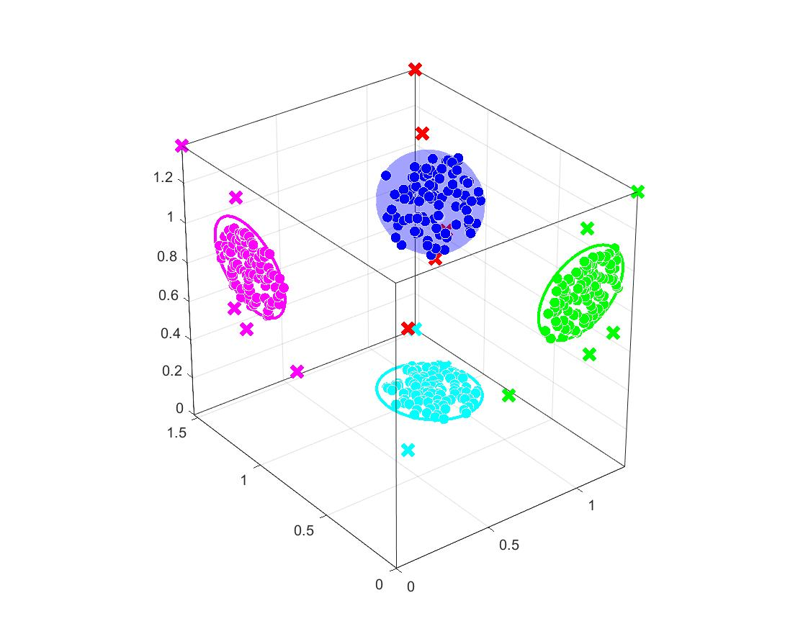

# Construction of Ellipsoid Convex Model with outlier detection and its application in Non-Probabilistic Topology Optimization

Thank you for visiting the repo for the current research!

The current repo contains the MATLAB(R) codes and data for the research "Construction of ellipsoid convex model of bounded uncertainties with outlier detection for application in non-probabilistic topology optimization".

The paper of this research can be found via <https://doi.org/10.1016/j.compstruc.2024.107322>

## Prerequisites

1. MATLAB(R) of version 2017b or higher is required.

2. The MATLAB(R) version of the CVX toolbox ought to be obtained via the link:
<https://cvxr.com/cvx/download/>.

3. The MATLAB(R) code of the MMA optimizer should be obtained following the instructions published on:
<https://people.kth.se/~krille/>.

Please install the CVX toolbox in MATLAB(R) following the directions provided therein.

After the MMA codes are obtained, please modify Line 195 in "det_lof_2d.m" in folder "NRTO" with the main function name of the MMA optimizer (usually left unchanged as "mmasub" therein).

Also, please modify Line 222 in "nrto_lof_2d.m" in folder "NRTO" with the main function name of the MMA optimizer (usually left unchanged as "mmasub" therein).

## Construction of the ellipsoid convex model

### The codes for this module are in the folder "construct_ECM"

The input parameters are included in the file "find_outlier_settings.json", where

1. "sample_filename": The Microsoft(R) Excel(R) file that contains the samples data.

2. "normalization": The flag of the normalization of the samples, "true" for normalize, "false" for not normalize.

***Execute the main function "find_outlier.m" to construct the ellipsoid convex model with outliers detection.***

## NRTO

### The codes for this module are in the folder "NRTO"

In this folder,

1. "deterministic_cantilever_beam.jason" contains the parameters for the deterministic topology optimization. The deterministic optimization is executed using the function "det_lof_2d.m".

2. The parameters for the NRTO are stored in the file "NRTO_cantilever_beam_##.jason", where "##" represents the cases such as "NRTO_cantilever_beam_normal_1point2" is for NRTO based on
   normal samples and the target robustness index being 1.2.

   ***Modify Line 21 in "nrto_lof_2d.m" to chage the case before executing NRTO using this function.***

## Showcase for the present study

### Outlier detection of 3D samples and construction of ellipsoid convex model

## Application in Non-probabilistic Robust Topology optimization

### Deterministic solution's evolution

### Evolution of robust solution based on the normal samples

### Evolution of robust solution based on all samples

